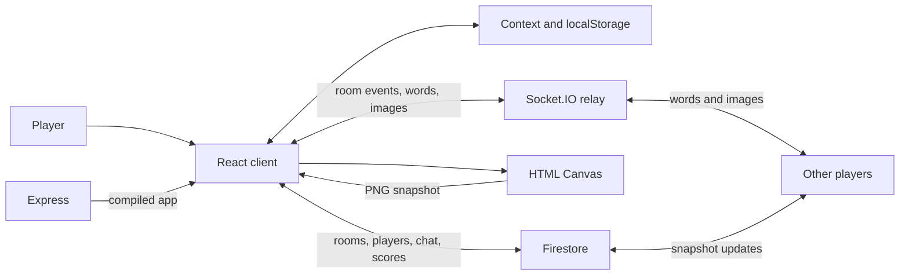

## Why I built this

Doodlesy is a browser game built around one simple idea: one player draws a word and everyone else guesses it. A game runs several rounds, and the faster you guess, the more points you get.

## How it works

The React client does profiles, rooms, the lobby, drawing, chat and game progression. Context holds shared state and localStorage keeps your nickname and avatar. You create a room with a six-digit code or join with one.

Firestore holds a document per room with its players, scores, messages, mode and start flag, and snapshot listeners keep the player list and chat current. Guess It sends words and PNG canvas snapshots through Socket.IO rooms. The Express server relays those events and serves the compiled React app. Turns, timers and guess scoring all run in the client.

The source also has two more modes, Rate It! and Grand Reveal, which save drawings in Firestore to show and rate later. I never finished wiring them up (the lobby checks for `Rate It` while room creation uses `Rate It!`), so Guess It is the one that works.



## Key features

- **Rooms by code.** Create a room, share its code, or join with one. The host starts the game from a lobby.
- **Drawing controls.** Preset colours, a custom picker, brush width and opacity. The eraser just paints white.
- **Live drawing relay.** The canvas becomes a PNG data URL, broadcast through Socket.IO. Other clients load it onto their own canvas.
- **Timed guessing and scores.** Three rounds, 60 seconds a turn. Guesses ignore letter case, and the later you guess, the fewer points you get.
- **Shared chat and player list.** Firestore listeners keep them current. Once you guess right, your chat input is disabled.
- **Saved profile.** A nickname editor and 24 avatars, both kept in the browser.

## Project structure and stack

```text
client/
├── public/avatars/          # Selectable profile images
└── src/
    ├── assets/             # Images, loading animation, and audio
    ├── context/            # Shared player and room state
    └── components/
        ├── HomePage/       # Entry page
        ├── Profile/        # Nickname and avatar editor
        ├── PlayPage/       # Mode selection and room dialogs
        ├── Gameplay/       # Lobby, chat, and player list
        ├── Modes/          # Game modes and word bank
        ├── Canvas/         # Drawing controls and rating UI
        ├── Timer/          # Round, word, and time display
        └── Twitch/         # Unfinished audience voting component
```

The root `server.js` hosts the client build and the Socket.IO relay. Firebase is set up in `client/src/firebase.js`, with its API key from `REACT_APP_API_KEY`.

Core technologies:

- **React 17 and JavaScript:** components, hooks and Context, with React Router.
- **Firebase Firestore:** room documents, snapshot subscriptions and rating transactions.
- **Socket.IO:** room membership and word and image broadcasts.
- **Node.js and Express:** HTTP server and static hosting.
- **HTML Canvas:** freehand drawing and PNG serialisation.
- **Material UI, Framer Motion and Howler:** dialogs, page transitions and navbar music.

## Decisions and tradeoffs

- **Two paths for shared data.** Rooms and chat live in Firestore, while live drawings go through Socket.IO. The relay stays tiny, but every client depends on two services.
- **Whole images instead of stroke events.** With PNG snapshots, receivers just load an image. The cost is heavier messages than strokes would need, and no stroke history to edit.
- **Game progression in the client.** Turns, elapsed time and guess scores are worked out in React, and the server only relays events. The logic sits next to the UI, but the server never checks scores or turns, so nothing stops a client from cheating.

## What was hard

- **Drawing at turn boundaries.** The drawing broadcast broke around turn changes. The fix (`76a4cc8`) changed the socket endpoint, delayed advancing the turn and cleared the canvas through the transition.
- **Ending a turn once everyone has guessed.** `1328e0e` counts successful-guess messages, resets the initial time and pushes a zero-time update to move the game on. It still works that way, and there are no regression tests behind it.
- **Leaving on reload.** `6bf3884` added a `beforeunload` handler that removes the player and deletes the room if it's empty. Async cleanup during unload isn't guaranteed to finish, so this is best effort.

## Testing and evals

There are no tests. The client declares React Testing Library and a test script, but I never wrote any, and the root test script exits with "no test specified".

```sh
npm --prefix client test
```

## What's next

It's archived, but the README's future scope still stands:

- Report and kick controls.
- Random rooms and undo/redo.
- Three word choices for the drawer.
- Finishing the other modes and the Twitch voting component, which is commented out, with an empty channel and a chart fed random values.
