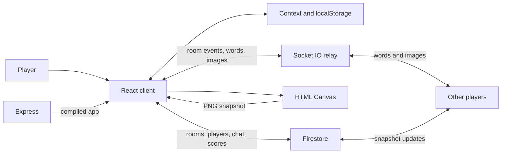

## Why I built this

Doodlesy is a browser game built around one simple interaction: one player draws a word while everyone else tries to guess it. A game runs over several rounds, and points depend on how quickly you guess.

## How it works

The React client handles profiles, room creation, the lobby, drawing, chat and game progression. React Context holds shared client state, and localStorage keeps your nickname and avatar. Players create a room with a six-digit code or join with an existing one.

Firestore stores a document per room with its players, scores, messages, selected mode and start flag. Snapshot listeners keep the player list and chat up to date. Guess It sends words and PNG canvas snapshots through Socket.IO rooms. The Express server relays those events and serves the compiled React app. Turns, timers and guess scoring run in the client.

The source also has two more modes, Rate It! and Grand Reveal, which save drawings in Firestore to show and rate later. They were never fully wired up (the lobby checks for `Rate It` while room creation uses `Rate It!`), so Guess It is the finished one.



## Key features

- **Rooms by code.** Create a room, copy its code, or join with one. The host starts play from a lobby that shows the players and game settings.
- **Drawing controls.** A canvas with preset colours, a custom colour picker, brush width and opacity. The eraser switches the brush to white.
- **Live drawing relay.** Guess It turns the canvas into a PNG data URL and broadcasts it through Socket.IO. Other clients load that image onto their own canvas.
- **Timed guessing and scores.** Three rounds with a 60-second turn. Guesses ignore letter case, and the later you guess, the fewer points you get.
- **Shared chat and player list.** Firestore listeners keep messages, players and scores up to date. After a correct guess, that player's chat input is disabled.
- **Saved profile.** A nickname editor and 24 avatars, both kept in the browser.

## Project structure and stack

```text
client/
├── public/avatars/          # Selectable profile images
└── src/
    ├── assets/             # Images, loading animation, and audio
    ├── context/            # Shared player and room state
    └── components/
        ├── HomePage/       # Entry page
        ├── Profile/        # Nickname and avatar editor
        ├── PlayPage/       # Mode selection and room dialogs
        ├── Gameplay/       # Lobby, chat, and player list
        ├── Modes/          # Game modes and word bank
        ├── Canvas/         # Drawing controls and rating UI
        ├── Timer/          # Round, word, and time display
        └── Twitch/         # Unfinished audience voting component
```

The root `server.js` hosts the client build and the Socket.IO relay. Firebase is set up in `client/src/firebase.js`, with its API key from `REACT_APP_API_KEY`.

Core technologies:

- **React 17 and JavaScript:** components, hooks and Context drive the client.
- **Firebase Firestore:** room documents, snapshot subscriptions and rating transactions.
- **Socket.IO:** room membership and word and image broadcasts.
- **Node.js and Express:** HTTP server, static build hosting and client route fallback.
- **HTML Canvas:** freehand drawing and PNG serialisation.
- **Material UI:** dialogs, inputs, tooltips and icons.
- **React Router:** home, play and profile routes.
- **Framer Motion:** page entry and exit animations.
- **Howler:** background music from the navbar.

## Decisions and tradeoffs

- **Two paths for shared data.** Rooms and chat live in Firestore, while live drawings go through Socket.IO. The relay stays tiny, but every client depends on two separate services.
- **Whole images instead of stroke events.** Broadcasting PNG snapshots means receivers just load and draw an image. The cost is a heavier message than a compact stroke protocol, and no editable stroke history.
- **Game progression in the client.** Turns, elapsed time and guess scores are worked out in React, and the server only relays events. The game logic stays next to the UI, but the server never checks scores or turns on its own.

## What was hard

- **Drawing at turn boundaries.** The drawing broadcast broke around turn changes. The fix (`76a4cc8`) changed the socket endpoint, delayed turn advancement and cleared the canvas through the transition.
- **Ending a turn once everyone has guessed.** `1328e0e` counts successful-guess messages, resets the initial time and pushes a zero-time update to move the game on. The chat still works this way, with no regression tests behind it.
- **Leaving on reload.** `6bf3884` added a `beforeunload` handler that removes the player and deletes the room if it's empty. Asynchronous cleanup during a browser unload isn't guaranteed to finish, so this is best effort.

## Testing and evals

There are no tests. The client declares React Testing Library and a Create React App test script, but nothing is implemented, and the root test script exits with "no test specified".

```sh
npm --prefix client test
```

## What's next

The project is archived, but the README's future scope still stands:

- Report and kick controls.
- Random rooms and undo/redo.
- Three word choices for the drawer.
- Finishing the other modes and the Twitch voting component, which is commented out with an empty channel and a chart fed random values.
