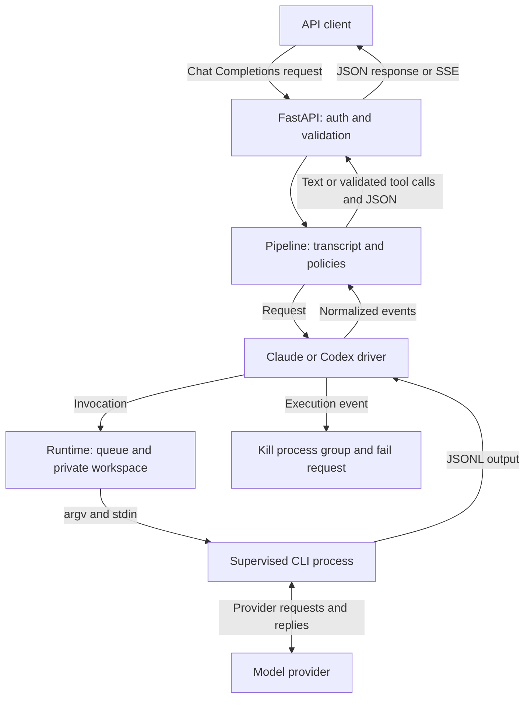

## Why I built this

Coding CLIs already talk to model providers, but their command-line interfaces don't match the Chat Completions interface so many applications use. I built ModelMux around that translation problem: accept familiar HTTP requests and turn CLI output back into familiar responses. ([README](https://github.com/smit153/modelmux/blob/main/README.md))

The other constraint is execution. These CLIs can run commands, touch files and call tools. I use them as text models, switch off their execution features and reject execution events. Application tools still run in the client, after ModelMux validates the requested calls. ([Architecture](https://github.com/smit153/modelmux/blob/main/docs/ARCHITECTURE.md))

## How it works

HTTP handling, request orchestration, process supervision and provider-specific translation are separate layers. Each container picks one driver. The API checks authentication, input limits and model availability before the pipeline renders messages into a transcript with random role boundaries.

The runtime gives each request an empty private workspace, a minimal environment and a supervised CLI process group. The driver translates JSONL output into common events. The pipeline then returns text, validates simulated tool calls or validates structured output. Invalid structured or tool output gets one corrective retry within the original time budget.

CLI flags and binary hashes are pinned and certified when the image is built. On startup the server verifies that certificate, checks container hardening and probes the provider before it accepts requests. ([Configuration](https://github.com/smit153/modelmux/blob/main/docs/CONFIGURATION.md))



## Key features

- **Chat Completions compatibility.** Ordinary responses, SSE streaming, model listing and OpenAI-shaped errors. Parameters the CLIs can't honour are reported in an ignored-parameters response header.
- **Execution tripwire.** Built-in tools, hooks, MCP servers and other execution paths are disabled. If an execution event still shows up, the pipeline kills the process group and fails the request.
- **Client-side tool calling.** The model describes a tool call, ModelMux validates the tool name and arguments, and returns an OpenAI `tool_calls` response. The calling application owns execution.
- **Validated structured output.** JSON objects and JSON Schema output, including strict mode. These responses are buffered until validation and any corrective retry finish, even when streaming is requested.
- **Bounded process runtime.** Queue limits, output caps, and first-output, idle and total timeouts. Cleanup kills descendants and removes the workspace before releasing the concurrency slot.
- **Local setup CLI.** `up`, `login`, `config`, `status`, `logs`, `doctor`, `upgrade` and `logout`. The Python launcher drives Docker with no runtime package dependencies.
- **Operational visibility.** Optional authenticated Prometheus metrics and JSON logs with request IDs. Logs leave out prompts and completions by default, and secrets are redacted.

## Project structure and stack

```text
modelmux/
├── server/
│   ├── src/modelmux/
│   │   ├── api/           # HTTP validation, authentication and responses
│   │   ├── core/          # Prompts, pipeline, tools and structured output
│   │   ├── runtime/       # Process supervision, limits and workspaces
│   │   ├── drivers/       # Claude and Codex invocation and event parsing
│   │   └── observability/ # Logs, redaction and metrics
│   └── tests/             # Unit, integration, contract, security and live checks
├── cli/python/
│   ├── src/modelmux_cli/  # Docker setup, login and management commands
│   └── tests/             # CLI behavior, storage, terminal and packaging checks
├── shared/                # Provider data, configuration templates and release pin
├── docker/                # Hardened image, Compose example and pinned CLI packages
├── docs/                  # Setup, architecture, configuration and release guides
└── .github/workflows/     # Checks, image scanning and release automation
```

Core technologies:

- **Python:** 3.12 for the server and 3.10+ for the management CLI.
- **FastAPI and Uvicorn:** HTTP routing, middleware, application lifecycle and serving.
- **asyncio:** subprocess I/O, cancellation, streaming and concurrency control.
- **Pydantic and pydantic-settings:** request schemas and validated environment configuration.
- **Docker and Compose:** provider containers, persistent login volumes and runtime hardening.
- **Claude Code and Codex CLI:** the provider-facing subprocesses, pinned in the image's npm lockfile.
- **jsonschema:** validation of model-generated JSON and simulated tool arguments.
- **prometheus-client:** optional server metrics.
- **pytest and pytest-asyncio:** offline behaviour checks and opt-in live Claude checks.
- **GitHub Actions, uv, Ruff and mypy:** dependency installation, linting, strict typing, tests and release checks.

## Decisions and tradeoffs

- **The server sticks to translation and execution safety.** That gives up built-in budgets, routing and fallbacks. The README points to a gateway such as LiteLLM for those.
- **Tool calls and structured output are buffered.** Those requests lose incremental delivery, but invalid output never reaches the client before validation. The one repair attempt shares the original deadline, so retries stay bounded. ([Pipeline](https://github.com/smit153/modelmux/blob/main/server/src/modelmux/core/pipeline.py))
- **One server worker per container.** The concurrency limiter is process-local, so I scale with containers rather than workers to keep its limits meaningful. ([Application factory](https://github.com/smit153/modelmux/blob/main/server/src/modelmux/main.py))
- **CLI behaviour is certified at build time.** Changing binaries or lockdown settings needs a new certificate. In exchange, startup verifies hashes instead of repeating the fixed CLI checks. Account-dependent model discovery and login checks still happen at startup. ([Commit a36e2ca](https://github.com/smit153/modelmux/commit/a36e2ca))

## What was hard

**Cancellation could race process cleanup.** A cancelled request could leave cleanup before the CLI was dead. The runner now waits through cancellation, finishes killing the process group and then re-raises. The regression test cancels twice while a process that ignores SIGTERM is being killed, then checks the group is gone. ([Commit 09582d0](https://github.com/smit153/modelmux/commit/09582d0))

**A harmless provider event looked like execution.** Claude emitted an empty `commands_changed` event under the minimal environment. Empty events are allowed now, while non-empty command lists still hit the tripwire, with a recorded fixture and parser test. ([Commit 86a43dd](https://github.com/smit153/modelmux/commit/86a43dd))

**Streaming cancellation needed its own boundary.** Starlette's cancellation scope can cancel every await during response cleanup. The pipeline stream runs in a separate asyncio task, so a disconnect cancels it once and the runner can finish cleaning up. ([Architecture](https://github.com/smit153/modelmux/blob/main/docs/ARCHITECTURE.md#streaming-and-disconnects))

## Testing and evals

The server uses pytest and pytest-asyncio. Unit tests cover schemas, prompts, parsers, validation, configuration and certification. Integration tests run scriptable fake CLIs through real subprocess supervision and API flows, including timeouts, output caps, streaming and cleanup. A fixture checks for leftover fake CLI processes and workspaces after every server test.

Contract tests run the OpenAI SDK and LangChain against the API. Security tests cover injection, leakage, execution tripwires and source rules that restrict process spawning. CLI tests cover command behaviour, secret storage, Compose generation, login output, terminal handling and release data.

CI requires at least 90% server coverage overall, and separately for `core`, `runtime`, `drivers` and `api`. That's an enforced threshold, not a measured result. The CLI matrix covers Linux, macOS and Windows on Python 3.10 and 3.13. Image checks include hardening smoke tests, vulnerability scanning and an SBOM.

```bash
# offline suites, from the repository root
(cd server && uv sync --locked && uv run pytest)
(cd cli/python && uv sync --locked && uv run pytest)

# live Claude checks: opt-in, need a logged-in Claude CLI, make real requests
cd server
LIVE_DRIVER_HOME="$HOME" uv run pytest -m live tests/live
```

There's no recorded successful live Codex run yet. Its fixtures separate captured authentication failures from hand-written success and failure events based on the Codex source schema. There's no quality benchmark or user-impact evaluation. ([Codex fixtures](https://github.com/smit153/modelmux/blob/main/server/tests/fixtures/codex/README.md))

## What's next

- **Live Codex validation.** Successful replies haven't been observed live yet. Coverage today comes from source-derived fixtures and offline CLI checks.
- **The API scope is deliberately narrow.** Inputs are text only, and the server implements Chat Completions without the Responses API, embeddings or the Anthropic Messages API.
- **Another launcher.** The shared language-neutral data is there so a second launcher, such as Node, can reuse it.
