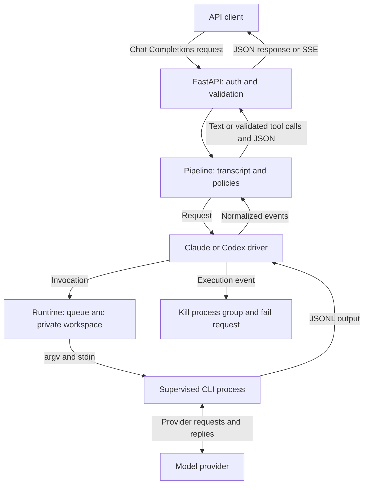

## Why I built this

Coding CLIs already talk to model providers, but they don't speak Chat Completions, which is what most apps and SDKs expect. ModelMux sits in between: it takes normal HTTP requests and turns CLI output back into normal responses. ([README](https://github.com/smit153/modelmux/blob/main/README.md))

The catch is execution. These CLIs can run commands and touch files, and I don't want that behind an API. So I treat them as plain text models, switch off everything that executes and reject any execution event. Your app's tools still run in your client, after ModelMux validates the calls. ([Architecture](https://github.com/smit153/modelmux/blob/main/docs/ARCHITECTURE.md))

## How it works

HTTP handling, orchestration, process supervision and provider translation are separate layers, and each container runs one driver. The API checks auth, input limits and model availability, then the pipeline renders the messages into a transcript with random role boundaries.

Each request gets an empty private workspace, a minimal environment and its own supervised process group. The driver turns the CLI's JSONL output into common events, and the pipeline returns text or validates tool calls and structured output. Invalid output gets one corrective retry inside the original time budget.

CLI flags and binary hashes are pinned and certified at image build. At startup the server checks that certificate and the container hardening, and probes the provider, before it takes requests. ([Configuration](https://github.com/smit153/modelmux/blob/main/docs/CONFIGURATION.md))



## Key features

- **Chat Completions compatibility.** Responses, SSE streaming, model listing and OpenAI-shaped errors. Parameters the CLIs can't honour are listed in a response header.
- **Execution tripwire.** Built-in tools, hooks, MCP servers and other execution paths are off. If an execution event shows up anyway, the process group is killed and the request fails.
- **Client-side tool calling.** The model describes a call, ModelMux validates the name and arguments and returns an OpenAI `tool_calls` response. Your app runs the tool.
- **Validated structured output.** JSON objects and JSON Schema, including strict mode. These are buffered until validation and any retry finish, even if you asked for streaming.
- **Bounded process runtime.** Queue limits, output caps and first-output, idle and total timeouts. Cleanup kills descendants and removes the workspace before the slot is freed.
- **Local setup CLI.** `up`, `login`, `config`, `status`, `logs`, `doctor`, `upgrade` and `logout`, from a Python launcher that drives Docker.
- **Operational visibility.** Optional Prometheus metrics and JSON logs with request IDs. Prompts and completions stay out of the logs by default.

## Project structure and stack

```text
modelmux/
├── server/
│   ├── src/modelmux/
│   │   ├── api/           # HTTP validation, authentication and responses
│   │   ├── core/          # Prompts, pipeline, tools and structured output
│   │   ├── runtime/       # Process supervision, limits and workspaces
│   │   ├── drivers/       # Claude and Codex invocation and event parsing
│   │   └── observability/ # Logs, redaction and metrics
│   └── tests/             # Unit, integration, contract, security and live checks
├── cli/python/
│   ├── src/modelmux_cli/  # Docker setup, login and management commands
│   └── tests/             # CLI behavior, storage, terminal and packaging checks
├── shared/                # Provider data, configuration templates and release pin
├── docker/                # Hardened image, Compose example and pinned CLI packages
├── docs/                  # Setup, architecture, configuration and release guides
└── .github/workflows/     # Checks, image scanning and release automation
```

Core technologies:

- **Python:** 3.12 for the server, 3.10+ for the CLI.
- **FastAPI, Uvicorn and asyncio:** routing, serving, subprocess I/O and cancellation.
- **Pydantic:** request schemas and validated environment config.
- **Docker and Compose:** provider containers, login volumes and hardening.
- **Claude Code and Codex CLI:** the subprocesses, pinned in the image's npm lockfile.
- **jsonschema and prometheus-client:** output validation and optional metrics.
- **pytest, uv, Ruff, mypy and GitHub Actions:** tests, strict typing, linting and releases.

## Decisions and tradeoffs

- **The server only does translation and execution safety.** So no budgets, routing or fallbacks. The README points to a gateway such as LiteLLM for those.
- **Tool calls and structured output are buffered.** Those requests lose incremental delivery, but invalid output never reaches the client. The repair attempt shares the original deadline, so retries stay bounded. ([Pipeline](https://github.com/smit153/modelmux/blob/main/server/src/modelmux/core/pipeline.py))
- **One server worker per container.** The concurrency limiter is process-local, so I scale with containers, not workers, or its limits would mean nothing. ([Application factory](https://github.com/smit153/modelmux/blob/main/server/src/modelmux/main.py))
- **CLI behaviour is certified at build time.** Changing binaries or lockdown settings needs a new certificate. In exchange, startup just verifies hashes instead of repeating the fixed CLI checks. Model discovery and login checks depend on the account, so they still run at startup. ([Commit a36e2ca](https://github.com/smit153/modelmux/commit/a36e2ca))

## What was hard

**Cancellation could race process cleanup.** A cancelled request could bail out of cleanup before the CLI was actually dead. The runner now waits through the cancellation, finishes killing the process group, then re-raises. The regression test cancels twice while a process that ignores SIGTERM is being killed, then checks the group is gone. ([Commit 09582d0](https://github.com/smit153/modelmux/commit/09582d0))

**A harmless provider event looked like execution.** Under the minimal environment, Claude emitted an empty `commands_changed` event. Empty ones are allowed now and non-empty command lists still trip the wire. There's a recorded fixture and a parser test for it. ([Commit 86a43dd](https://github.com/smit153/modelmux/commit/86a43dd))

**Streaming cancellation needed its own boundary.** Starlette's cancellation scope can cancel every await during response cleanup. So the pipeline stream runs in its own asyncio task. A disconnect cancels it once, and the runner can finish cleaning up. ([Architecture](https://github.com/smit153/modelmux/blob/main/docs/ARCHITECTURE.md#streaming-and-disconnects))

## Testing and evals

Unit tests cover schemas, prompts, parsers, validation, config and certification. Integration tests run scriptable fake CLIs through real subprocess supervision: timeouts, output caps, streaming and cleanup. A fixture checks that nothing is left running afterwards.

Contract tests run the OpenAI SDK and LangChain against the API. Security tests cover injection, leakage, the tripwire and source rules that restrict process spawning. CLI tests cover commands, secret storage and Compose generation.

CI requires at least 90% server coverage overall, and separately for `core`, `runtime`, `drivers` and `api`. That's a threshold CI enforces, not a measured result. The CLI matrix runs Linux, macOS and Windows on Python 3.10 and 3.13, and image checks include hardening smoke tests, vulnerability scanning and an SBOM.

```bash
# offline suites, from the repository root
(cd server && uv sync --locked && uv run pytest)
(cd cli/python && uv sync --locked && uv run pytest)

# live Claude checks: opt-in, need a logged-in Claude CLI, make real requests
cd server
LIVE_DRIVER_HOME="$HOME" uv run pytest -m live tests/live
```

I haven't recorded a successful live Codex run yet. Its fixtures keep captured authentication failures apart from hand-written success and failure events based on the Codex source schema. There's no quality benchmark and no user-impact evaluation. ([Codex fixtures](https://github.com/smit153/modelmux/blob/main/server/tests/fixtures/codex/README.md))

## What's next

- **Live Codex validation.** I haven't seen a successful live reply yet. Today it's covered by source-derived fixtures and offline CLI checks.
- **A narrow API, on purpose.** Text input only, Chat Completions only. No Responses API, embeddings or Anthropic Messages API.
- **Another launcher.** The shared data is language-neutral, so a Node launcher could reuse it.
