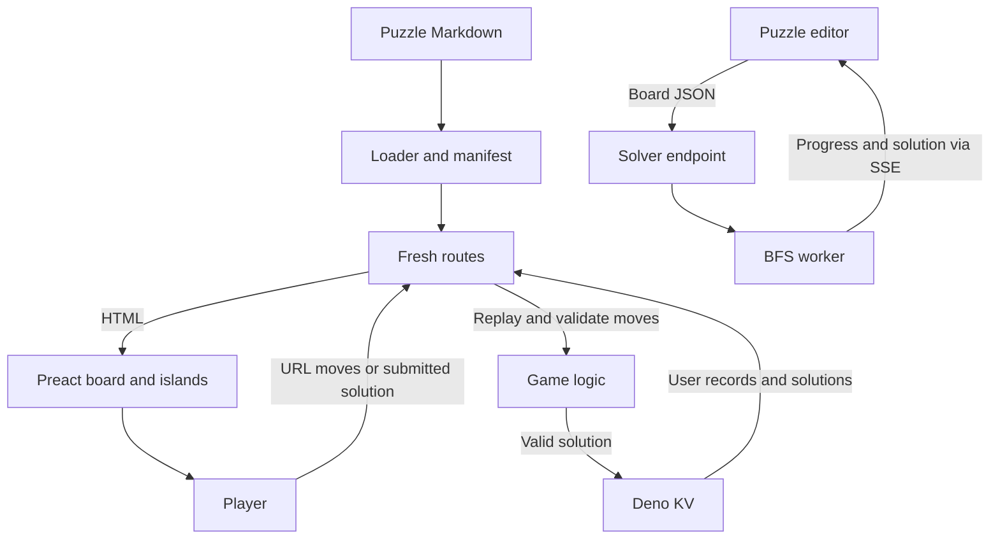

## Why I built this

Oshi borrows its premise from Ricochet Robots: slide pieces around a board and get the puck to the target in as few moves as you can. The name is Japanese for "push".

I decided early that play had to work server-rendered. Moves live in the URL, and you can finish and submit a puzzle with JavaScript off. Touch, keyboard controls and dialogs sit on top of that.

## How it works

Puzzles are Markdown files with YAML metadata and ASCII boards. A build plugin generates the manifest and the loader reads the files from disk. Fresh routes load the board, replay the moves from the URL and render Preact components, and islands add interaction with Signals.

When you submit a solution, the server replays the moves, checks the puck reaches the target and saves it in Deno KV, which also feeds profiles, streaks and comparisons.

The editor posts a board to a separate solver endpoint. A server-side worker runs a breadth-first search and streams progress and the solution back over server-sent events. The editor endpoint rejects boards already in the corpus, rotated or mirrored copies included.



## Key features

- **Play without JavaScript.** Moves are encoded in the URL and solutions go to the server. An end-to-end test runs the whole path with JavaScript disabled.
- **Daily puzzles and archives.** Numbered puzzles are scheduled, and future ones stay hidden outside development. Earlier boards stay playable.
- **Touch and keyboard controls.** Swipes, arrow keys, and shortcuts for undo, redo and hints.
- **Puzzle creation tools.** An editor, configurable generation, Markdown import and export, and a solver-backed minimum-moves badge so you can check a board as you edit.
- **Solution comparisons and replays.** Submitted paths are stored, equivalent solutions are grouped, and playback runs on generated CSS keyframes, so you see how a solution works and not just its move count.
- **Onboarding and progress.** Hands-on tutorials, skill-based recommendations and profile statistics give new players somewhere to start.

## Project structure and stack

```text
routes/          # Fresh pages, API endpoints, and route-level browser tests
islands/         # Hydrated Preact board, editor, dialogs, and controls
components/      # Server-rendered UI and shared presentation
game/            # Board rules, parser, solver, scoring, and recommendations
client/          # Browser input, Signals state, and solver stream handling
db/              # Deno KV user, solution, authentication, and stats operations
lib/             # Replay encoding, utilities, analytics, and tracing
plugins/         # Manifest generation, worker bundling, and import lint rules
static/puzzles/  # Markdown puzzle definitions
static/tiles/    # Reusable board pieces for composition
scripts/         # Corpus scoring, calibration, manifests, and test selection
e2e/             # Playwright fixtures and complete player journeys
specs/           # Archived design decisions and problem reports
```

Core technologies:

- **TypeScript and Deno:** runtime, tooling and unit tests.
- **Fresh 2, Preact and Signals:** routes, server rendering, islands and reactive board state.
- **Deno KV:** user records, solutions and aggregates.
- **Tailwind CSS and Open Props:** utilities and design tokens.
- **Vite and esbuild:** app builds and local solver-worker bundles.
- **Playwright:** browser tests inside Deno.
- **PostHog and OpenTelemetry:** product events and request tracing.

## Decisions and tradeoffs

- **Server-rendered play first.** The move history lives in the URL, so the server can rebuild the board with no browser state. I now maintain two ways to play, but the no-JavaScript path is testable.
- **BFS instead of IDA\*.** The history has an IDA\* refactor followed by a BFS rewrite. BFS finds a shortest solution without re-exploring the same states, and the price is a large visited-state pool. Typed arrays, a compact visited set and explicit search budgets keep that in check.
- **Local worker bundles.** The production solver worker is bundled with esbuild and loaded through a local file URL. That's extra build-plugin work, but Deno Deploy won't load HTTP modules at runtime, so I needed it.
- **Streaks include archive play.** Streaks count consecutive solved puzzle entries, so older solves can fill gaps. I dropped the strict consecutive-calendar-days rule because I'd rather reward solving a board whenever you play it (documented in `game/streak.ts`).

## What was hard

The first solver ran inline and blocked the server's event loop, so SSE progress sat in a buffer until the search finished. A worker fixed that. Then deployment bit me: worker URLs built at runtime over HTTP were blocked, which the local bundle handles. Both are written up in `specs/feat-solver-3.md` and the February solver commits.

Bad puzzle slugs once caused recursive requests: loading `toby.md` fetched `toby.md.md`, which matched the puzzle route again. The fix added slug validation and separated missing puzzles from real failures. Now the loader reads puzzle files straight from disk, and route middleware returns a 404 for missing ones. The failure chain is in `specs/fix-http-error.md`.

Portals made move notation ambiguous, because two slide directions can reach the same endpoint through different portals. I now record the entry portal for teleporting moves and still group by endpoint. One limit remains: solver-generated moves use plain endpoint pairs, so their replay can show the other route. See `specs/229-feat-editor-multi-solve.md`.

## Testing and evals

Deno's test runner covers board rules, parsing, formatting, the solver, scoring, skill progression, streaks and replay encoding. Solver tests cover shortest paths, unsolvable boards, depth limits, portals and holes.

Browser tests run Playwright through `Deno.test`, with fixtures that seed users and solutions and clean up afterwards. They cover onboarding, profiles, archives, editing and solution pages, and one full new-player run has JavaScript disabled.

Pull-request CI checks formatting, lint rules, tile validity and unit tests. A separate workflow runs selected browser tests against preview deployments. The corpus scoring and calibration scripts analyse puzzles, not player outcomes.

```sh
# Unit tests, matching pull-request CI
deno test -A --ignore='e2e/,routes/**/_e2e/'

# Browser tests need a running app, installed Chromium,
# and E2E_SECRET set for the test helper endpoints.
# BASE_URL defaults to http://localhost:5173.
deno task e2e

# Puzzle corpus checks
deno task check-calibration
deno task score-corpus
```

## What's next

- Make your own solution easier to find. TODOs on the solutions page call for separate scoreboard, personal and statistics tabs, and a highlighted row for you.
- Extend onboarding past the current sequence. `game/loader.ts` notes there are only a few levels.
- Count optimal onboarding solves in personal statistics. Those puzzles sit outside the archive entries it uses.
- Test the editor toolbar. The editor browser test has a TODO for placing walls, blockers and the puck through the toolbar and board clicks.
