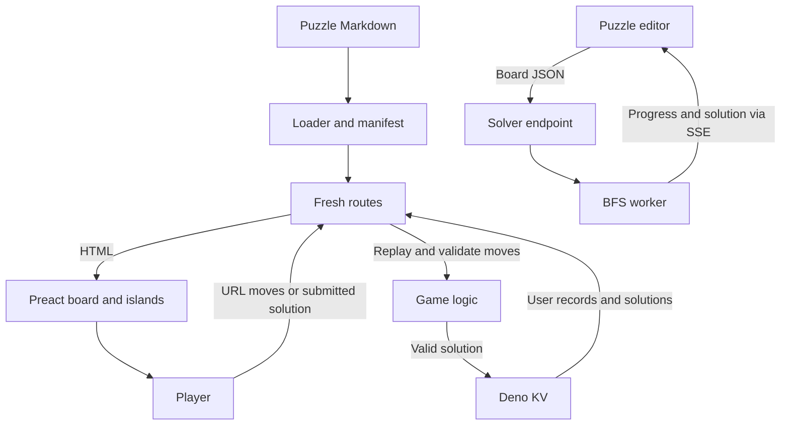

## Why I built this

Oshi takes its premise from Ricochet Robots: slide pieces around a board and get the puck to the target in as few moves as possible. The name is Japanese for "push".

I made server-rendered play a core constraint. The game carries moves in the URL, and you can finish and submit a puzzle without JavaScript. Touch input, keyboard controls and interactive dialogs build on top of that.

## How it works

Puzzles live in Markdown with YAML metadata and ASCII boards. A build plugin generates the manifest, and the loader reads puzzle files from disk. Fresh routes load the board, replay moves from the URL and render Preact components. Browser islands add interaction with Signals.

When a player submits a solution, the server replays the moves and checks that the puck reaches the target before saving it in Deno KV. User records and solution data feed profiles, streaks and solution comparisons.

The editor sends a board to a separate solver endpoint. A server-side worker runs a breadth-first search and streams progress and a solution back as server-sent events. Gameplay hints use their own puzzle route, and the editor endpoint rejects boards already in the puzzle corpus, including rotated or mirrored copies.



## Key features

- **Play without JavaScript.** Moves are encoded in the URL and solutions are submitted to the server. An end-to-end test runs the whole path with JavaScript disabled.
- **Daily puzzles and archives.** Numbered puzzles are scheduled, and future ones stay hidden outside development. Players can go back to earlier boards instead of losing them when the day ends.
- **Touch and keyboard controls.** Swipes, arrow keys, and shortcuts for undo, redo and hints. The same board works with mobile and desktop input.
- **Puzzle creation tools.** An editor, configurable generation, Markdown import and export, and a solver-backed minimum-moves badge, so creators can check a board while they edit it.
- **Solution comparisons and replays.** Submitted paths are stored, equivalent solutions are grouped, and playback runs on generated CSS keyframes. Players see how a solution works, not just its move count.
- **Onboarding and personal progress.** Hands-on tutorials, a replay fallback, skill-based recommendations and profile statistics give new players a starting point before the archive.

## Project structure and stack

```text
routes/          # Fresh pages, API endpoints, and route-level browser tests
islands/         # Hydrated Preact board, editor, dialogs, and controls
components/      # Server-rendered UI and shared presentation
game/            # Board rules, parser, solver, scoring, and recommendations
client/          # Browser input, Signals state, and solver stream handling
db/              # Deno KV user, solution, authentication, and stats operations
lib/             # Replay encoding, utilities, analytics, and tracing
plugins/         # Manifest generation, worker bundling, and import lint rules
static/puzzles/  # Markdown puzzle definitions
static/tiles/    # Reusable board pieces for composition
scripts/         # Corpus scoring, calibration, manifests, and test selection
e2e/             # Playwright fixtures and complete player journeys
specs/           # Archived design decisions and problem reports
```

Core technologies:

- **TypeScript:** game models, server handlers, browser state and tooling.
- **Deno:** runtime, task runner, formatter, linter and unit test runner.
- **Fresh 2:** file-based routes, server rendering and island hydration.
- **Preact and Signals:** UI components and reactive board and editor state.
- **Deno KV:** persistent user records, solutions and aggregates.
- **Tailwind CSS 4 and Open Props:** utilities, design tokens and themes.
- **Vite and esbuild:** application builds and local solver-worker bundles.
- **Playwright:** Chromium automation inside Deno end-to-end tests.
- **PostHog and OpenTelemetry:** product events and request tracing.

## Decisions and tradeoffs

- **Server-rendered play first.** The move history lives in the URL, so the server can rebuild the board without any browser state. That means maintaining both navigation-based play and the enhanced client, but it makes the no-JavaScript path testable.
- **BFS instead of IDA\*.** The history has an IDA\* refactor followed by a BFS rewrite. BFS finds a shortest solution without exploring the same states again and again, at the cost of a large visited-state pool. Typed arrays, a compact visited set and explicit search budgets keep that cost bounded.
- **Local worker bundles.** The production solver worker is bundled with esbuild and resolved through a local file URL. It's extra build-plugin work, but it avoids Deno Deploy's cached-only restriction on loading HTTP modules at runtime.
- **Streaks include archive play.** Streaks count consecutive solved puzzle entries, so older solves can fill gaps. I gave up a strict consecutive-calendar-days definition to reward playing whenever you solve a board (documented in `game/streak.ts`).

## What was hard

The original inline solver blocked the server's event loop, so SSE progress sat in a buffer until the search finished. Moving the search into a worker fixed that. Deployment added a second constraint: worker URLs built at runtime over HTTP were blocked. The local bundle handles that. Both problems are written up in `specs/feat-solver-3.md` and the February solver commits.

Invalid puzzle slugs once caused recursive requests: loading `toby.md` fetched `toby.md.md`, which matched the puzzle route again. The fix added slug validation and told missing puzzles apart from unexpected failures. Today the loader reads puzzle files straight from disk, and route middleware returns a 404 for missing puzzles. The failure chain is in `specs/fix-http-error.md`.

Portals made move notation ambiguous: two slide directions can reach the same endpoint through different portals. The fix records the entry portal for teleporting moves while keeping endpoint-based grouping. One limit remains: solver-generated moves still use plain endpoint pairs, so their replay can show the other route. See `specs/229-feat-editor-multi-solve.md`.

## Testing and evals

Deno's test runner and standard assertions cover board rules, parsing, formatting, solver behaviour, scoring, skill progression, streaks, replay encoding and utilities. Solver tests cover shortest paths, unsolvable boards, depth limits, exhaustive solution graphs, portals and holes.

Browser tests run Playwright through `Deno.test`, with fixtures that seed users and solutions and clean them up afterwards. They cover onboarding, returning players, profiles, archives, editing and solution pages. A complete new-player test runs with JavaScript disabled.

Pull-request CI checks formatting, lint rules, tile validity and unit tests. A separate workflow runs selected browser tests against successful preview deployments. Corpus scoring and calibration scripts analyse the puzzles; they don't measure player outcomes.

```sh
# Unit tests, matching pull-request CI
deno test -A --ignore='e2e/,routes/**/_e2e/'

# Browser tests need a running app, installed Chromium,
# and E2E_SECRET set for the test helper endpoints.
# BASE_URL defaults to http://localhost:5173.
deno task e2e

# Puzzle corpus checks
deno task check-calibration
deno task score-corpus
```

## What's next

- Make your own solution easier to find. TODOs on the solutions page propose separate scoreboard, personal-solutions and statistics tabs, plus highlighting the player's row.
- Extend onboarding beyond the current sequence. `game/loader.ts` calls out the limited number of onboarding levels.
- Count optimal onboarding solves in personal statistics. Those puzzles currently fall outside the archive entries used for that calculation.
- Add editor toolbar coverage. The editor browser test has a TODO for placing walls, blockers and the puck through the toolbar and board clicks.
